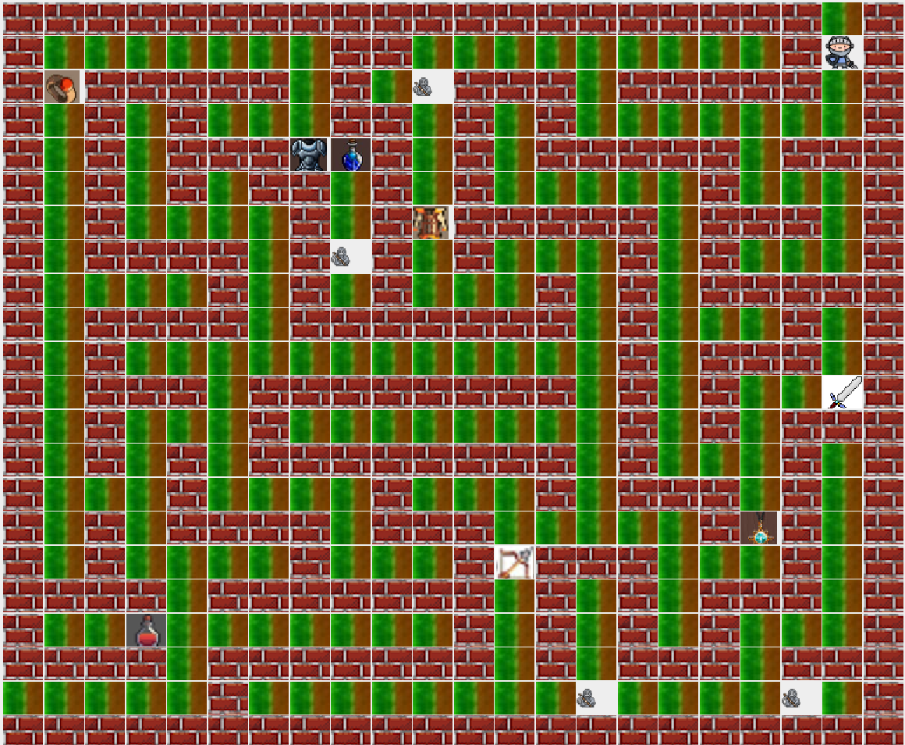
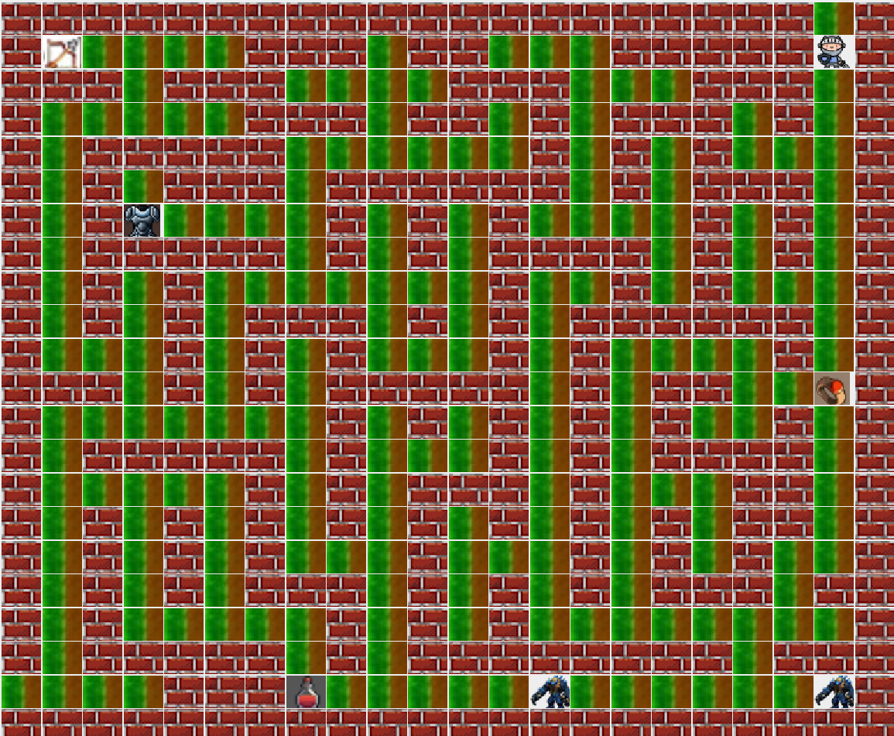
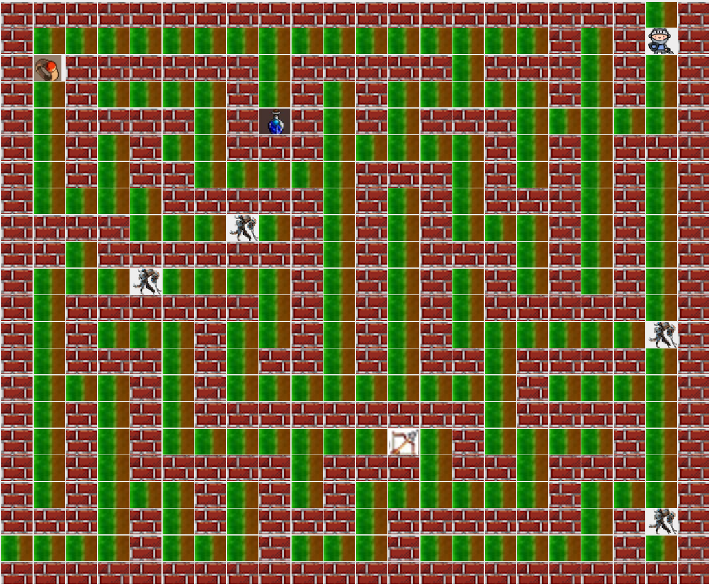

# Maze of Enchantment 🧙‍♂️🌀

## Table of Contents

1. [Project Summary](#project-summary-) 📝
2. [Description of the Game](#description-of-the-game-) 🎮
   - [Level 0: The Knight's Realm](#level-0-the-knights-realm-%EF%B8%8F) 🛡️
   - [Level 1: The Titan's Fortress](#level-1-the-titans-fortress-) 🗿
   - [Level 2: The Dragon's Lair](#level-2-the-dragons-lair-) 🐉
3. [List of Features](#list-of-features-%EF%B8%8F) ⚔️
4. [Installation and Setup](#installation-and-setup-) 💻
   - [Run Jar File (Recommended)](#run-jar-file-recommended-) 🚀
   - [Clone our Repository](#clone-our-repository) 🛠️
   - [Using Docker](#using-docker) 🐳
5. [Resources & Collaborators](#resources--collaborators) 📚

---

## Project Summary 📝

**Project Name**: Maze of Enchantment  
**Project Goals**: Create a text-based RPG maze game where players navigate through mazes, encounter enemies, collect items, and progress through various levels.

## Description of the Game 🎮

**Maze of Enchantment** takes players on an immersive journey through intricate mazes filled with enemies, hidden items, and strategic challenges. The goal is to guide the player from the top-right corner of each maze to the exit at the bottom-left corner, while navigating enemies and collecting useful items.

Players progress through **three levels**, each offering unique challenges and increasing difficulty:

### Level 0: The Knight's Realm 🛡️

In this initial level, players face off against **the Knight**, a skilled enemy known for its combat abilities and strategic placement in the maze. The maze in this level is relatively simple, allowing players to familiarize themselves with the game's mechanics, such as movement, enemy encounters, and item collection.



### Level 1: The Titan's Fortress 🗿

In the second level, players must contend with the **Titan**, a larger and more powerful enemy. The mazes become more complex, and the Titan exhibits more advanced behaviors, providing a significant increase in difficulty. Players must strategize carefully to collect items and defeat the Titan.



### Level 2: The Dragon's Lair 🐉

The final level pits players against the **Dragon**, a mythical creature of immense strength. The maze is highly intricate, and the Dragon’s presence adds a new layer of danger. Players will need to make full use of their inventory and strategy to survive this final challenge and escape the maze.



Each level introduces more formidable enemies and requires greater tactical thinking to overcome. Players must collect items like **armor, potions, and weapons** to enhance their chances of survival, and manage their inventory carefully to succeed.

## List of Features ⚔️

- **Movement**: Navigate using arrow keys or 'A', 'W', 'S', and 'D'.
- **Maze/Levels**: Players progress through 3 levels of increasing difficulty with distinct enemies (Knight, Titan, Dragon).
- **Enemies**: Various enemies with unique behaviors and interactions.
- **Inventory System**: Collect, manage, and use items like armor, potions, and weapons.
- **NPC Interaction**: Engage with enemies via dialogue and combat.
- **Player Attributes**: Player can enhance stats like health and attack.
- **Save and Load**: Save progress and continue from saved game states.
- **Testing**: JUnit tests for game functionality like enemy behavior and movement.

## Installation and Setup 💻

There are a couple of different ways you can run our game. They are mentioned below.

Ensure that your system has [JDK-17](https://www.oracle.com/java/technologies/javase/jdk17-archive-downloads.html) configured.

### Run Jar File (Recommended) 🚀

1. Download the [game jar executable file](/items/game.jar) from our repository.
2. Double-click on the file to run the game.
    * If that doesn't work, open the terminal and navigate to the directory in which the jar file resides.
    * Run the following command:  
      ```java -jar game.jar```

### Clone our Repository

1. Pre-requisite: You need to have Maven configured on your system. Follow this [guide](https://maven.apache.org/install.html).
2. Clone our repository:  
   ```git clone <this repo>```
3. Open the terminal and navigate to the root directory.
4. Run this command:  
   ```mvn exec:java -Dexec.mainClass="comp2120.a3.gui.StartGamePage"```
    * If that doesn't work, open the repository using an IDE and run the ```StartGamePage.java``` file.
    * We have multiple dependencies like JSON and JUnit. Add the libraries in the ```lib``` folder if necessary, although Maven should automatically handle it.

### Using Docker

1. Pre-requisite: 
    * Install [Docker](https://docs.docker.com/get-docker/).
    * Our game has a GUI, so configure the X11 display variable according to this [post](https://stackoverflow.com/questions/662421/no-x11-display-variable-what-does-it-mean).
2. Run the following commands in the terminal:
    ```bash
    docker pull ar4152/comp-2120-assignment-3-workshop-09-group-c:latest
    docker run -it ar4152/comp-2120-assignment-3-workshop-09-group-c:latest
    ```

## Resources & Collaborators 📚

For more detailed information about the game's development, design decisions, and technical documentation, please refer to the following resources in the repository:

- [Additional Documentation](./items/ADDITIONAL_DOCUMENTATION.md)
- [DevOps Documentation](./items/DEV_OPS.md)
- [Story Line](./items/story_line.md)
- [User Stories](./items/user_stories.md)

This project was completed as part of university coursework in collaboration with:

- WangLin Song
- Weng Kei Soo
- Yuecheng Hao
- Oscar Wei
