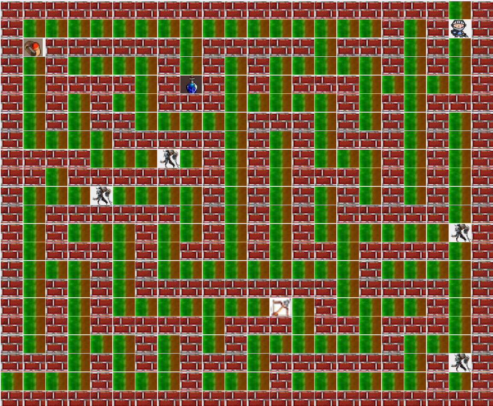

## Game Documentation

- [Project summary](#project-summary)
- [License](#license)
- [List of features](#list-of-features)
- [Description of game](#description-of-game)
- [DevOps](#devops)
- [Anything planned but not implemented](#anything-planned-but-didnt-have-time-to-implement)
- [Additional notes/information](#additional-notes-or-information-about-the-gameprocess)
- [Planning and scheduling of tasks/issues](#planning-and-scheduling-of-tasksissues)
- [Installation and setup](#installation-and-setup)

## Project summary

#### Project Name:

Maze of Enchantment

#### Project Goals:

Work as a team to organize, plan and produce a text-based RPG maze game with various game settings and environments

## License

We've chosen the MIT license for our project and added a [LICENSE.md](/LICENSE.md) file in the main repository.

The MIT License can be an appropriate choice for a game software created by university students for an assignment for several reasons:

1. Simplicity and Clarity: The MIT License is a simple, concise, and easy-to-understand open-source license. This makes it accessible to us (students) who may not be familiar with complex legal language, ensuring that we can quickly grasp the terms and conditions.

 

2. Flexibility: The MIT License is permissive, allowing for maximum flexibility in how the software is used, modified, and distributed. This flexibility is advantageous for us because we may want to experiment with different aspects of game development later, including sharing our work with others or incorporating open-source code from other projects.

 

3. Academic and Educational Purposes: The primary goal of university assignments is typically educational. The MIT License aligns well with educational goals because it allows for the free use, modification, and distribution of the software. This encourages collaboration, learning, and the sharing of knowledge, which are fundamental aspects of academia.

 

4. Encourages Collaboration: By using the MIT License, we (students) can collaborate with others more easily. Our classmates, professors, or even developers from outside the university can contribute to the project (obviously after assignment submission haha), providing valuable insights and improving the overall quality of the game.

 

5. Portfolio Building: We can showcase our work, including the game software, in our portfolios. Potential employers and collaborators are more likely to engage with projects that are open source and freely accessible, as it demonstrates the our skills and commitment to sharing their work with the community.

 

6. Community Involvement: Releasing the game software under the MIT License encourages involvement from the broader open-source community. This can lead to feedback, contributions, and improvements, which can be valuable for our growth as a developer.

 

7. Legal Protection: While the MIT License is permissive, it still provides some level of legal protection to the creators. It includes a disclaimer of liability, which can be important in case the software is used in unintended ways that might lead to legal issues.

 

8. Continued Use After the Assignment: If the game software has potential beyond the university assignment, the MIT License allows for its continued development and use outside the scope of the initial assignment. This can be valuable if we or other students want to continue working on the project or if it gains popularity.

 

In summary, the MIT License is appropriate for a game software created by university students for an assignment because it aligns with educational goals, encourages collaboration, provides legal protection, and offers flexibility for future use and development. It strikes a balance between openness and simplicity, making it a suitable choice for us (students) working on academic projects.

## List of features

### Game Features

#### Movement

Players can use the arrow keys or 'A', 'W', 'S', and 'D' keys for general movement which allows them to move left, right, forward, and backward.


#### Maze/Map/Level

In this maze game, players find themselves within a labyrinthine world characterized by brick walls and a lush grassy path. As the player navigates through the maze, they'll discover a variety of items scattered throughout the labyrinth. These items are thoughtfully placed, serving as both incentives and strategic tools to help the player make it to the exit and advance to the next level. Some items may provide bonuses or abilities that aid in overcoming obstacles and collecting these items would increase the player's gameplay experience.

The ultimate goal for the player is to navigate through the maze, starting from the top right corner and reach the elusive exit located at the bottom left corner of the maze.

Our game offers a progressive challenge across three levels, with each level introducing a more formidable enemy and intricate maze layouts.

In Level 0, players will confront the knight, a formidable opponent known for his combat skills and strategic prowess.


As they advance to Level 1, they will face the titan, which has increased strength and complexity in its behavior. 


Finally, in Level 2, players will encounter the ultimate enemy as they confront the dragon, a creature of legendary power. 



With each level, the game escalates in difficulty, providing a thrilling and progressively demanding experience for players as they navigate through increasingly intricate mazes and face increasingly formidable enemies.

#### Enemies

The maze isn't just a solitary realm that can be navigated through easily. There are enemies strategically located throughout the maze, each with their own distinct behaviors and characteristics, guard valuable items, patrol critical junctures or fight the players when encountered presenting unique challenges to the player.

We have different types of enemies such as the knight, titan and dragon.


#### Inventory System
- Inventory Items:
Players collect various items when navigating through the maze, such as Steel Plate Armor, Leather Vest, Mana Potions, Health Elixirs, Longbows, Silver Swords, and mystical artifacts like the Amulet of Shadows and the Ring of Fortitude. These items play a crucial role in the player's journey, offering protection, enhancements and special abilities.


- Inventory Management: 
The items collected by the player throughout the game can be viewed in the inventory where the name, description, value, and powers of the item would be displayed. Players can also decide whether to use or remove the items from the inventory.


#### NPC

Texts showing dialogues would appear when the player interacts with the NPC such as asking for a fight or the attacking process between the player and the enemy. Here are some key features of the NPC in the game:

- Different attack damage and maximum blood levels for NPCs based on their level (Knight, Titan, Dragon).
- Parameters for patrol and movement for future use.
- Two different states for NPCs: Move and Attack.
- NPCs can engage in dialogues with the player.


#### Player

The Player represents the player character in the game. It has attributes such as blood, attack, inventory, and movement. Here are some key features of the Player in the game:

- The player can move within the maze, interact with items, and engage in battles with NPCs.
- The player can collect and use items from their inventory.
- The player's attributes, such as blood and attack, can be enhanced through items.
- The player can initiate dialogue with nearby NPCs.


#### Testing

There are tests to ensure that the game frame and enemy behavior functions correctly, helping to maintain the reliability and integrity of the game.

GameFrameTest The GameFrameTest class contains a series of JUnit tests for the GameFrame class. These tests cover various aspects of the game frame, including initialization, keypress handling, and level switching.

Here are the test cases covered for global game framework:

<pre>testInit: Tests the initialization of the GameFrame. \\ testShowDialog: Tests the dialog display in the GameFrame. \\ testHandleKeyPressUp: Tests keypress handling for moving up.\\ testHandleKeyPressDown: Tests keypress handling for moving down.\\ testHandleKeyPressLeft: Tests keypress handling for moving left.\\ testHandleKeyPressRight: Tests keypress handling for moving right.\\ testSwitchToNextLevel: Tests switching to the next level in the GameFrame.</pre>EnemyTest The EnemyTest class contains a series of JUnit tests for the Enemy class. These tests cover various aspects of enemy behavior, including loading data, NPC characteristics, movement, and interactions with the player.

Here are the test cases covered for Enemy feature:

<pre>testLoadData: Tests loading data for enemies.\\ testMazeMapNotNull: Tests that the maze map is not null.\\ testLevel1Npc: Tests characteristics of a level 1 NPC.\\ testLevel2Npc: Tests characteristics of a level 2 NPC.\\ testLevel3Npc: Tests characteristics of a level 3 NPC.\\ testMoveDirection: Tests NPC movement directions.\\ testChasingUp: Tests NPC chasing behavior when the player moves up.\\ testChasingDown: Tests NPC chasing behavior when the player moves down.\\ testChasingLeft: Tests NPC chasing behavior when the player moves left.\\ testChasingRight: Tests NPC chasing behavior when the player moves right.\\ testMoveUp: Tests NPC movement when chasing up.\\ testMoveDown: Tests NPC movement when chasing down.\\ testMoveLeft: Tests NPC movement when chasing left.\\ testMoveRight: Tests NPC movement when chasing right.\\ testNpcAttackPlayer: Tests NPC attack behavior when encountering the player.</pre>

#### Game Engine 

- Save and Load

The "Save and Load" feature in our game engine allows players to save their progress and load their saved games at a later time. It ensures that players can pick up where they left off and provides a convenient way to manage game states.

During the game, press number 1, 2, and 3 to save the game in 3 save Game Archives. 

When click load game and choose one of the archives, you can load the game you saved.

- Level Design Tools

Our game features level design tools that streamline the creation and editing of game levels and environments. This allows the layout of the maze, placement of items in the maze, and types of enemies faced by the player to be changed accordingly to their level.

The switchToNextLevel() method is responsible for the game's level transition, allowing players to progress to the next level after successfully completing the previous one. It ensures that the design of each level, including the maze layout, item placement, and potential NPC encounters, is appropriately loaded and presented to the player. 

```
public void switchToNextLevel() {
        //move to next level if the player beats the level
        System.out.println("Switch to next level!");
        currentLevelIndex++;
        System.out.println("Now you are in level: " + currentLevelIndex);
        if(DataUtil.getLevel(currentLevelIndex) != null) {
            mazeData = DataUtil.getLevel(currentLevelIndex).getMap();
            // itemsInMaze = DataUtil.getItemForLevel(currentLevelIndex);
            int startingX = 20;
            int startingY = 1;
            player.setX(startingX);
            player.setY(startingY);
            mazePanel.removeAll();
            mazePanel.revalidate();
            mazePanel.repaint();
            createNpcs();
            initUI();
        } else {

            System.err.println("Error: Level data is null for level " + currentLevelIndex);
        }

    }
```

- User Interface

The user interface (UI) feature in our game engine focuses on creating an intuitive and visually appealing in-game interface for players.

- GameFrame.java represents the main game window and handles the rendering of the game world, player, NPCs, items, various UI elements, and also manages player input and interactions.


- InventoryGUI.java represents the inventory management interface, allowing the player to view and manipulate their inventory, including removing items and using items.


- StartGamePage.java represents the game's start page by allowing players to start a new game, load a game, or exit the application.

## Description of game

Fantasy Maze allows players to embark on an immersive gamming experience that integrates strategic navigation, inventory management, and encounters with a variety of NPCs. The game unfolds in a fantasy world which boasts captivating visuals from intricate brick walls to the grassy paths designed to engage players in an atmosphere of mystery to heightened the overall gaming experience.

The primary goal of the game is for players to navigate their character through the mazes from the top-right corner to the elusive exit hidden at the bottom-left corner of each level. As the player progresses, there will be an increase in the complexity of the mazes where every move would require strategic planning and thinking.

As players explore the maze, they will come across items, each with its own unique purpose and the strategic use and management of these items become the key to success in the labyrinth. Whether it is the protective qualities of Steel Plate Armor and Leather Vest, the restorative properties of Mana Potions and Health Elixirs, or the offensive capabilities of Longbows and Silver Swords, these items play a pivotal role in enhancing the player's abilities. There are also special artifacts like the Amulet of Shadows and the Ring of Fortitude which provides the players with special abilities and powers.

Throughout the maze, players would also encounter various enemies like the knights, titans and dragons that are patrolling critical junctions that the player must pass through, guarding precious items, or waiting to attack the players. Through these interactions with the NPCs, players would be able to fully immerse into the enchanting labyrinth of our fantasy world.

## DevOps

We have efficently done DevOps in our project. 

- Maven
- CI/CD Script
- Docker
- GitLab Features
    * Milestones
    * Issues

See [DevOps page](devops) for more details


## Installation and Setup

There are a couple of different ways you can run our game. They are mentioned below.

Ensure that your system has [JDK-17](https://www.oracle.com/java/technologies/javase/jdk17-archive-downloads.html) configured

### Run Jar File (Recommended)

1. Download the [game jar executable file](/items/game.jar) from our repository
2. Double click on the file to run the game
     * If that doesn't work, open the terminal and navigate to the directory in which the jar file resides
     * Run the following command: ```java -jar game.jar```

### Clone our repository

1. Pre-requisite: You need have Maven configured on your system. Follow this [guide](https://maven.apache.org/install.html)
2. Clone our repository: ```git clone <this repo>```
3. Open terminal and navigate to the root directory
4. Run this command: ```mvn exec:java -Dexec.mainClass="comp2120.a3.gui.StartGamePage"```
     * If that doesn't work, open the repository using an IDE and run the ```StartGamePage.java``` file
     * We have multiple dependencies like JSON and JUnit. Add the libraries in ```lib``` folder if necessary, although maven should automatically do it.

### Using Docker
1. Pre-requisite: 
      * Install [Docker](https://docs.docker.com/get-docker/)
      * Our game has GUI so configure X11 display variable according to this [post](https://stackoverflow.com/questions/662421/no-x11-display-variable-what-does-it-mean)
2. Run the following commands in the terminal
      * ```docker pull ar4152/comp-2120-assignment-3-workshop-09-group-c:latest```
      * ```docker run -it ar4152/comp-2120-assignment-3-workshop-09-group-c:latest```

## Members

- Arjun Raj 
- WangLin Song
- Weng Kei Soo
- Yuecheng Hao
- Oscar Wei