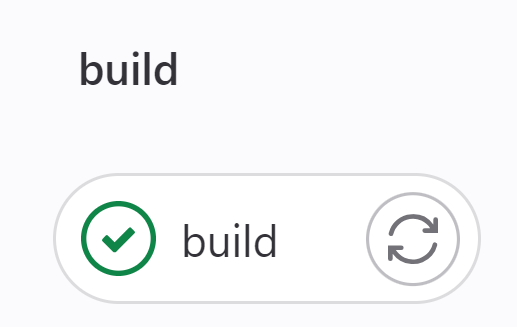
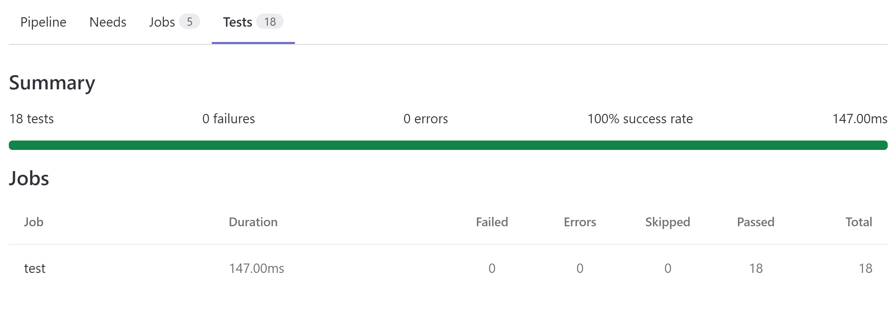
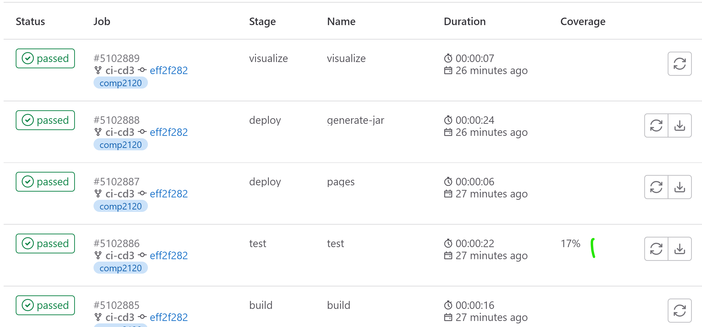
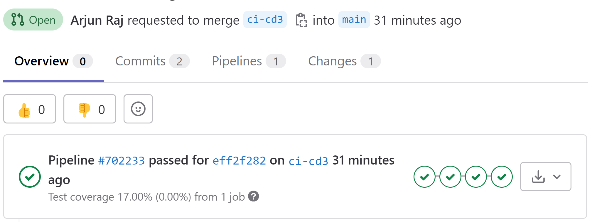
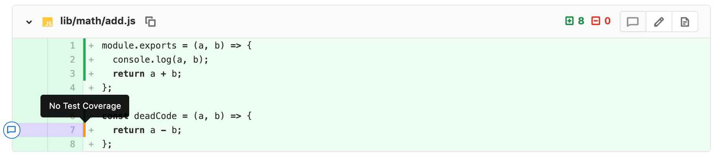
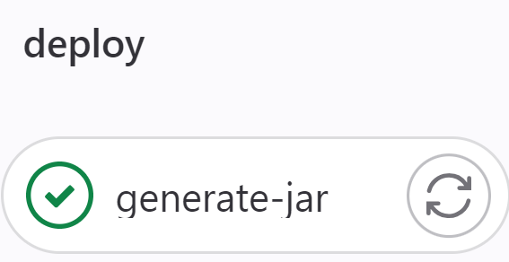
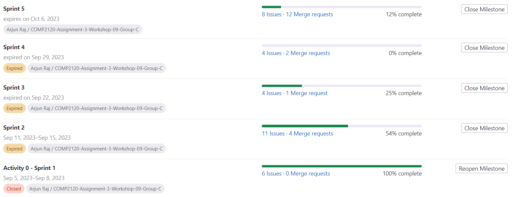

# Dev Ops

## Maven
Maven is a widely used build and project management tool in the Java ecosystem, and it offers several benefits that make it a popular choice for Java projects.

Initially, we weren't using Maven. This caused several inconvience during the development of the game.
1. Without Maven, we had to manage project dependencies manually. This was time-consuming and error-prone, as we had to download libraries, manage versions, and ensure that all developers on our team had the correct dependencies in their local environments.
2. It was quite difficult to build CI without Maven. This was one of the reasons, we migrated to Maven.
3. More...

After migrating to Maven tool, we benefited from several advantages:
1. Dependency Management: Maven simplifies the management of project dependencies. Using the configuration file (pom.xml), Maven will automatically download and manage the required libraries from remote repositories like the Maven Central Repository. This ensures that our project has the correct versions of dependencies without manual intervention.

2. Build Automation: Maven automates the build process for your project. It provides predefined build phases, such as clean, compile, test, package, and install, which we can execute with simple commands. This automation reduces the likelihood of build errors and makes the build process more efficient.

3. Plugins: Maven has a rich ecosystem of plugins that extend its functionality. You can use plugins to perform various tasks, such as code analysis, code generation, documentation generation, and deployment to different environments. We used several plugins to run tests and generate JAR files. This helped a lot

4. Integration with Continuous Integration (CI): Gitlab CI/CD had built-in support for Maven. This integration makes it easier to set up automated build and deployment pipelines for our Java project. You can have a look at our script [here](/.gitlab-ci.yml).

## Continuous Integration and Continuous Deployment Script

We made full utilization of CI/CD script and it helped us a lot. Below are the different parts of the script.

- [Build Stage](#build-stage)
- [Testing Stage](#testing-stage)
- [Test Coverage Visualization](test-coverage-visualization)
- [Jar Deployment](#jar-deployment)

### Build Stage

The build stage ensured that all over java code compiled properly. If this failed, the script wouldn't move to next parts.



### Testing Stage
This is the most helpful stage for us. It ran all the tests and outputted the code coverage. We used the the JaCoCo plugin from Maven to aid this.

#### Testing Artifacts:



#### Code Coverage Output (the image is a sample. our coverage is higher):



#### Coverage Reporting in PR:



Additionally, please note that [GameFrameTest.java](/src/test/java/GameFrameTest.java) has been excluded from running on GitLab because it needs a window to open and GitLab CI doesn't support it. So, our code coverage is much higher than the one reported on GitLab.

### Test Coverage Visualization

We have a script to visualize the code coverage line by line in all of the Java files like the one shown in the below image. However, CECS GitLab has disabled ```Pages``` feature. Hence, it was not usable.



### Jar Deployment

Thanks to Maven, we also developed a script to automatically package our game java files into a JAR file and put it in the items folder.



## GitLab Tools

### Milestones

We used milestones to represent the work during sprints.



### Issues

We created issues to for the user stories, bugs and other works. They were fine grained.
